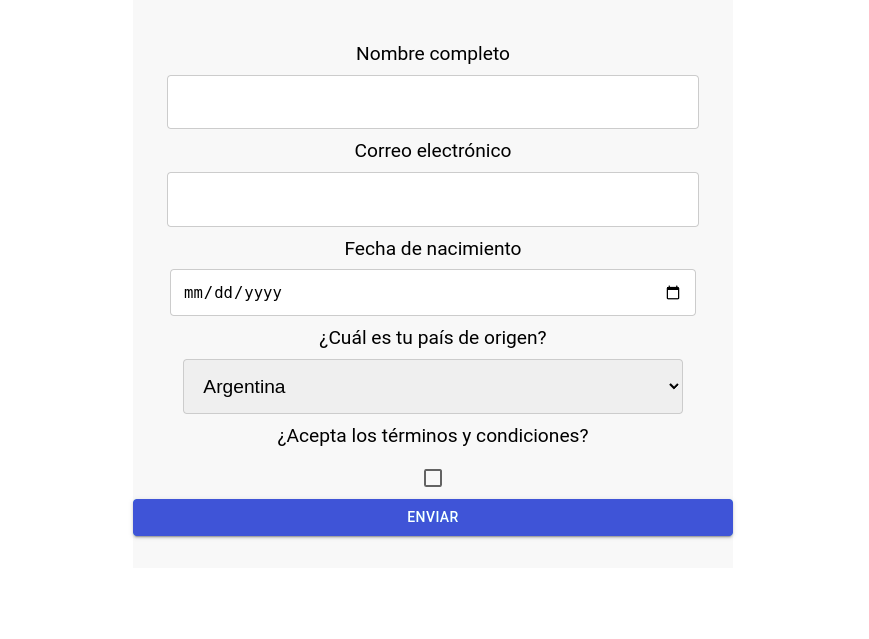
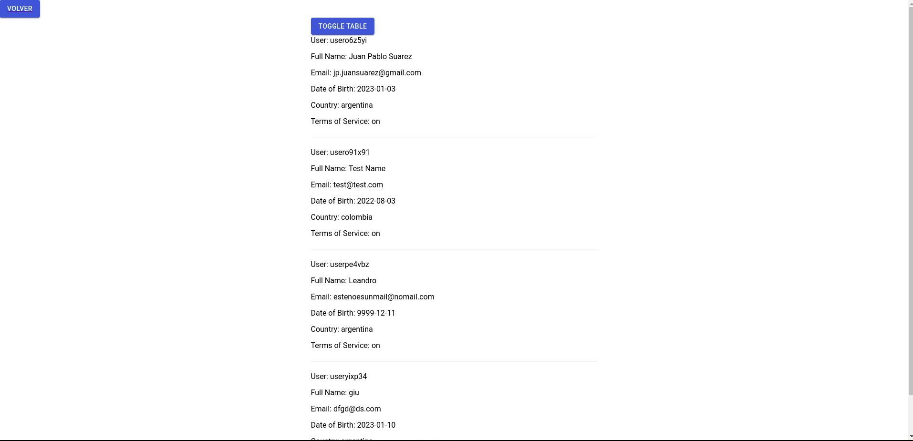

[](https://choosealicense.com/licenses/mit/)


# ReactJs + Firebase - Form Challenge

Este proyecto es un una webapp hecho en React.js que te permite llenar un formulario. El diseño y estética del formulario es diferente al de Google Forms. Se utiliza Firebase como base de datos en tiempo real para guardar las respuestas del formulario.

El formulario se armó a partir de un archivo JSON externo, donde cada elemento genera una interfaz para la app. Las respuestas se guardan en una base de datos en tiempo real de Firebase. 

Una vez enviado el formulario, se pueden ver las respuestas en una ruta llamada "AnwersForm" dentro de la misma app.
## Screenshots
<p align="center">
  
  
</p>


## Run Locally

Clone the project

```bash
  git clone https://github.com/JuanPSuarez/reactjs-firebase-form
```

Go to the project directory

```bash
  cd reactjs-firebase-form
```

Install dependencies

```bash
  npm install
```

Start the server

```bash
  npm start
```


## Authors

- [@JuanPSuarez](https://github.com/JuanPSuarez)

